# About Me 
I am a dedicated developer with experience in various programming languages and frameworks.

**Check out my portfolios:**  

  

  

**Available for hire** - open to remote opportunities and exciting collaborations!  
If you're interested in working together or discussing opportunities, feel free to connect with me on [LinkedIn](https://www.linkedin.com/in/zulahmadk/)

Let’s build something amazing together!
---

---

## GitHub Stats

  

 

<table align="center">
  <tr>
    <td>
      
    </td>
    <td>
      
    </td>
  </tr>
</table>

 

  

## Techstacks & Wakatime Stats 

<table align="center">
  <tr>
    <td align="center">
      <figure>
        
      </figure>
    </td>
    <td align="center">
      <table>
        <tr>
          <td></td>
          <td></td>
          <td></td>
          <td></td>
        </tr>
        <tr>
          <td></td>
          <td></td>
          <td></td>
          <td></td>
        </tr>
        <tr>
          <td></td>
          <td></td>
          <td></td>
          <td></td>
        </tr>
        <tr>
          <td></td>
          <td></td>
          <td></td>
          <td></td>
        </tr>
      </table>
    </td>
  </tr>
</table>

---
